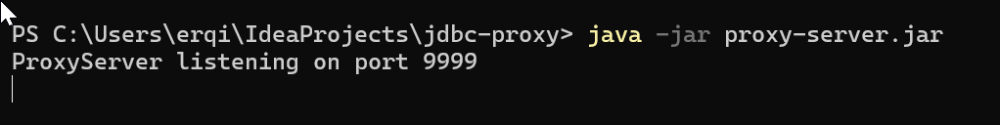
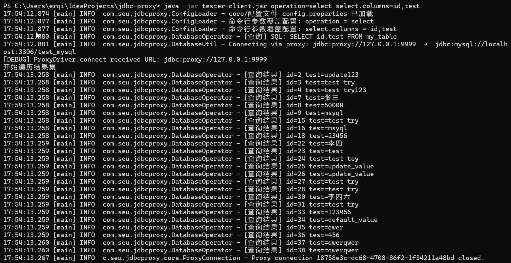
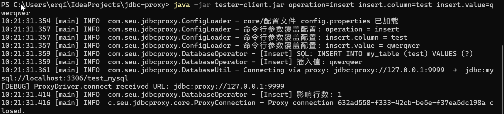
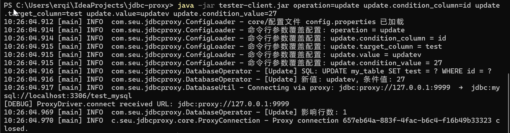
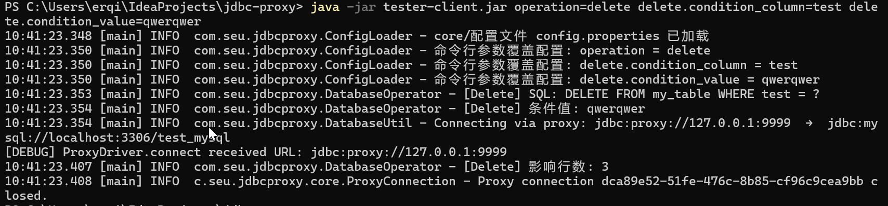
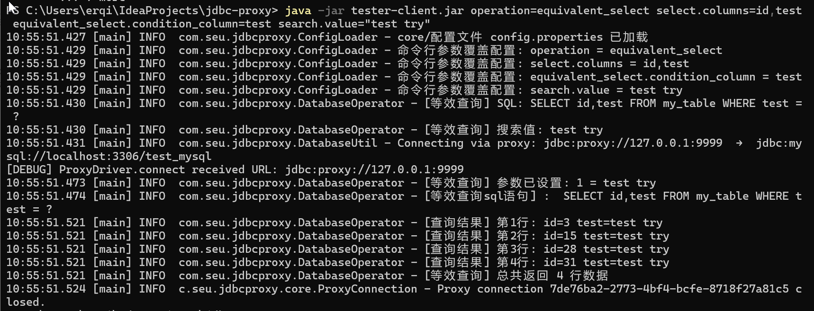
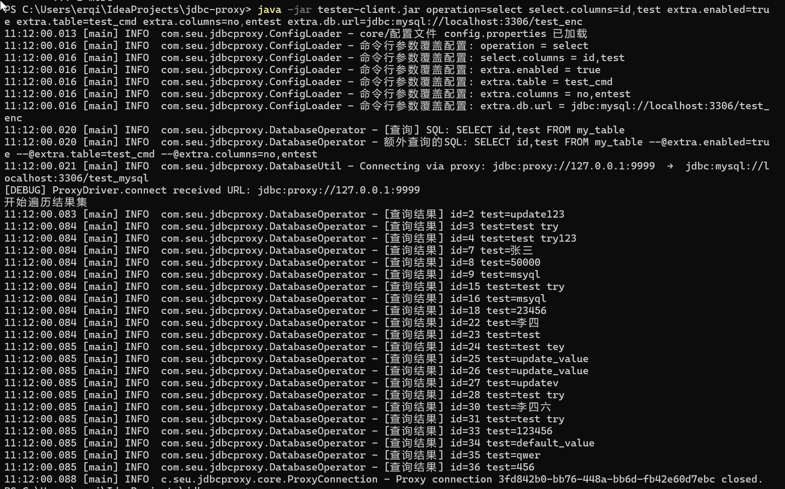
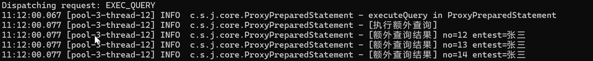

# encrypt-jdbc-proxy项目说明文档

## 概述

JDBC Proxy 是一个客户端-服务器模式的数据库代理系统，支持密态数据库的存储与加密。服务器监听指定端口，拦截客户端发来的SQL语句，进行改写后与真实数据库通信，最后返回结果给客户端。

## 部署要求

### 环境要求

- Java 8 或更高版本
- MySQL 数据库
- 网络连接（客户端到服务器，服务器到数据库）

### 文件清单

- `jdbc-proxy-core/target/jdbc-proxy-core-0.2.0-SNAPSHOT-jar-with-dependencies.jar` 服务器端
- `jdbc-proxy-tester/target/jdbc-proxy-tester-0.2.0-SNAPSHOT-jar-with-dependencies.jar` - 客户端测试工具
- 为了测试方便，将两个jar分别重命名为`proxy-server.jar`和`tester-client.jar`并放在主目录下

### 测试数据库表结构

- 表1：自增主键列 `id` 和存放密文的列 `test`，表名为 `my_table` ，测试中大部分时候使用的表
- 表2：自增主键列 `no` 和存放密文的列 `entest` ，表名为 `test_cmd`

## 启动服务器端

1. 启动服务器jar包

 

2. 另开一个Powershell，开始进行测试

## 基本功能使用说明

1. 普通 select 查询

**命令格式：**

```
java -jar tester-client.jar operation=select select.columns=id,test [可选参数]
```

**参数说明：**

- `select.columns` - 指定查询的列，**必需**

- `table.name` - 指定查询的表名
- `db.realUrl` - 指定查询的数据库url

**输出结果示例：**

 

2. 加密插入

**命令格式：**

```
java -jar tester-client.jar operation=insert [参数]
```

**参数说明：**

- `insert.value` - 插入的值
- `insert.column` - 插入的列名
- `table.name` - 指定表名
- `db.realUrl` - 指定数据库url

**输出结果示例：**

 

3. 更新操作

**命令格式**：

```bash
java -jar tester-client.jar operation=update [参数]
```

**参数说明**：

- `update.value` - 新的值
- `update.condition_value` - 条件值
- `update.target_column` - 目标列名
- `update.condition_column` - 条件列名
- `table.name` - 指定表名
- `db.realUrl` - 指定数据库url

**输出结果示例：**

 

4. 删除操作

**命令格式：**

```bash
java -jar tester-client.jar operation=delete [参数]
```

**参数说明**：

- `delete.condition_value` - 条件值
- `delete.condition_column` - 条件列名
- `table.name` - 指定表名
- `db.realUrl` - 指定数据库url

**输出结果示例：**

 

5. 等值查询

**命令格式**：

```bash
java -jar tester-client.jar operation=equivalent_select [参数]
```

**参数说明**：

- `search.value` - 搜索值
- `select.columns` - 指定查询的列
- `table.name` - 指定表名
- `equivalent_select.condition_column` - 条件列名
- `db.realUrl` - 指定数据库url

**输出结果示例：**

 

6. 额外查询

**命令格式：**

```bash
java -jar tester-client.jar operation=select select.columns=id,test extra.enabled=true extra.table=test_cmd extra.columns=no,entest
```

**参数说明**：

- `extra.enabled` - 启用额外查询（true/false）
- `extra.table` - 额外查询的表名
- `extra.columns` - 额外查询的列名

**输出结果示例：** 

下图为主查询输出

 

下图为副查询输出，**副查询输出放在了服务器端，如果需要显示到客户端，需要另做修改**



## 配置说明

### 默认配置文件

客户端jar包内包含 `config.properties` 配置文件，包含以下默认配置：

```properties
# 数据库连接配置
db.realUrl=jdbc:mysql://localhost:3306/test_mysql
db.user=root
db.password=200261

# 表配置
table.name=my_table
select.columns=id,test

# 插入配置
insert.column=test
insert.value=default

# 更新配置
update.condition_column=id
update.target_column=test
update.value=default
update.condition_value=1

# 删除配置
delete.condition_column=test
delete.condition_value=test

# 等值查询配置
equivalent_select.condition_column=test
search.value=default
```

有关额外查询的配置文件被放在 `core` 模块中

如果测试失败，可以先用全部用到的参数在命令行进行替换尝试
